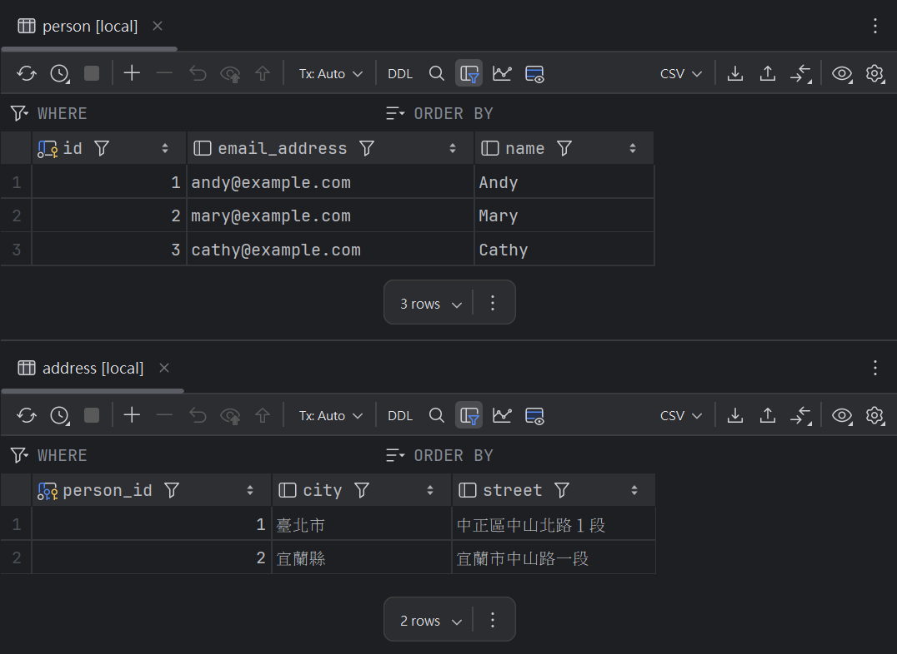

# Implementing one-to-one relationship With a Shared Primary Key

## Getting Started

### Entity

- 關聯的兩個 table 都需要宣告 @OneToOne，因為是雙向關係。
- Person 作為關係的擁有者，所以 @JoinTable 宣告在 Person。

### Notice

實例：`Application.java`

操作 Person 時，只會影響 `person` 和 `person_address`，不會影響 `address` 的資料。
因此，如果要在取消關聯時移除 `address` 對應的資料，需單獨使用 `addressRepository.delete()`。

## Entity Relationship Diagram


## SQL



```sql
create sequence person_sequence;

create table person
(
    id            bigint not null
        primary key,
    email_address varchar(255),
    name          varchar(255)
);
```
```sql
create sequence address_sequence;

create table address
(
    id     bigint not null
        primary key,
    city   varchar(255),
    street varchar(255)
);
```
```sql
create table person_address
(
    person_id  bigint not null
        primary key
        constraint fknndfs0btabect8upo03uwgfxt
            references person,
    address_id bigint
        unique
        constraint fkcyc1krsxqelkm4uwh65avij23
            references address
);
```
