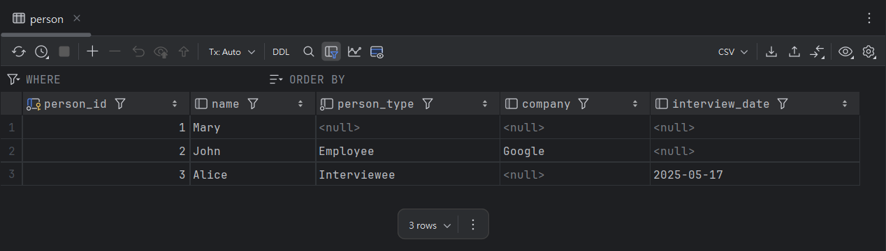

# spring-data-jpa-3.4.x

## SingleTable

### JPA

```java

@Entity
@Inheritance(strategy = InheritanceType.SINGLE_TABLE)
@DiscriminatorColumn(name = "person_type", discriminatorType = DiscriminatorType.STRING)
@DiscriminatorValue("null")
public class Person {
    @Id
    @SequenceGenerator(name = "person_sequence", sequenceName = "person_sequence", allocationSize = 1)
    @GeneratedValue(strategy = GenerationType.SEQUENCE, generator = "person_sequence")
    @Column(updatable = false)
    private long personId;

    private String name;

    // Constructor, getters and setters
}

@Entity
@DiscriminatorValue("Employee")
public class Employee extends Person {
    private String company;

    // Constructor, getters and setters
}

@Entity
@DiscriminatorValue("Interviewee")
public class Interviewee extends Person {
    private LocalDate interviewDate;

    // Constructor, getters and setters
}
```

### Postgres



```sql
create table person
(
    person_id      bigint      not null
        primary key,
    name           varchar(255),
    person_type    varchar(31) not null,
    company        varchar(255),
    interview_date date
);
```
