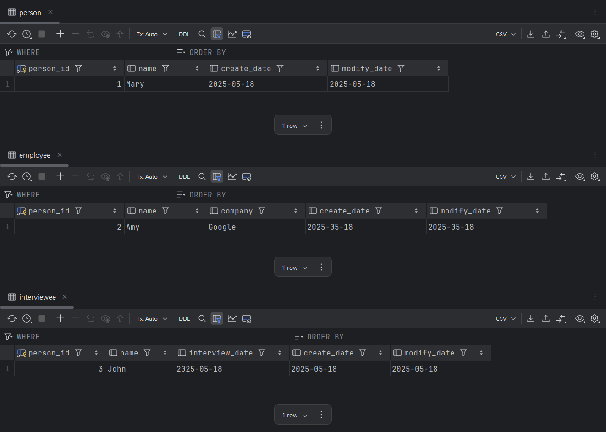

# JPA 繼承策略：Table per Class

`@Inheritance(strategy = InheritanceType.TABLE_PER_CLASS)` 是一種為每個具體類別（concrete class）建立獨立資料表的繼承策略。

基底類別與每個子類別皆會對應到一張獨立資料表，且彼此之間**不共享 table**，也不會進行 join 操作。

## 概念說明

- 設計原則：
    - 每個實體類別都對應一張資料表，包含繼承自父類別的所有欄位。
    - 父類別的共通欄位會複製到每張子類別資料表中。
    - 查詢父類別時，JPA 會 UNION 所有子類別的資料表，並將結果合併。
    - 查詢子類時，JPA 僅查詢對應表，不會查其他表或進行聯結。
- 優點：
    - 查詢子類別時效能良好，無需 JOIN，可直接命中表。
    - 資料表結構簡單、無需額外 discriminator 欄位。
- 缺點：
    - 使用 UNION 進行 polymorphic 查詢，效能較差。
    - 主鍵生成策略限制：不支援 `SEQUENCE` 或 `AUTO`（因為這些通常是全表唯一），需改用 `TABLE` 或手動分配。

## 實作範例

### JPA Entity

```java

@Entity
@Inheritance(strategy = InheritanceType.TABLE_PER_CLASS)
public class Person {
    @Id
    @Column(updatable = false)
    private long personId;

    private String name;

    private LocalDate createDate;

    private LocalDate modifyDate;

    // Constructors, getters, setters
}

@Entity
public class Employee extends Person {
    private String company;

    // Constructors, getters, setters
}

@Entity
public class Interviewee extends Person {
    private LocalDate interviewDate;

    // Constructors, getters, setters
}
```

- 建議每個實體類別都定義自己的主鍵生成策略，例如使用 GenerationType.TABLE 或手動指定。

### PostgreSQL DDL

```sql
create table person
(
    person_id   bigint not null
        primary key,
    name        varchar(255),
    create_date date,
    modify_date date
);

create table employee
(
    create_date date,
    modify_date date,
    person_id   bigint not null
        primary key,
    company     varchar(255),
    name        varchar(255)
);

create table interviewee
(
    create_date    date,
    interview_date date,
    modify_date    date,
    person_id      bigint not null
        primary key,
    name           varchar(255)
);
```

- 每張表皆包含 Person 的共通欄位。

### 資料展示



## 使用情境與建議

- 適用場景
    - 每個子類別獨立運作，查詢時大多數只需要單一類型，使用多型（polymorphic）查詢的機會不高。
    - 系統中每個子類別的生命週期與邏輯高度獨立，無需交叉（JOIN）查詢。
- 不適用場景
    - 需要頻繁進行 polymorphic 查詢。
    - 須依賴 JPA 的主鍵自動生成機制（特別是 SEQUENCE）。

## 總結

TABLE_PER_CLASS 策略提供了結構簡單、查詢快速的優點，適用於子類型彼此獨立的情境。

然而，它犧牲了 polymorphic 支援與資料一致性，並增加了資料冗餘與維護成本。
